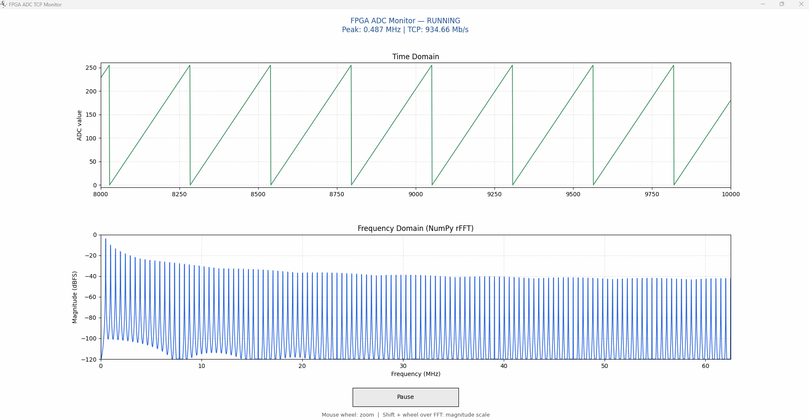
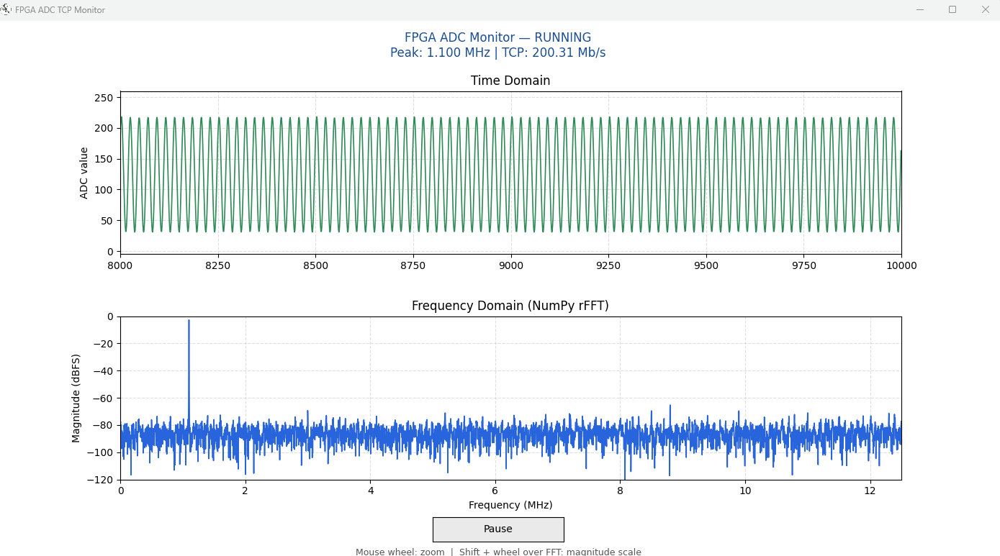
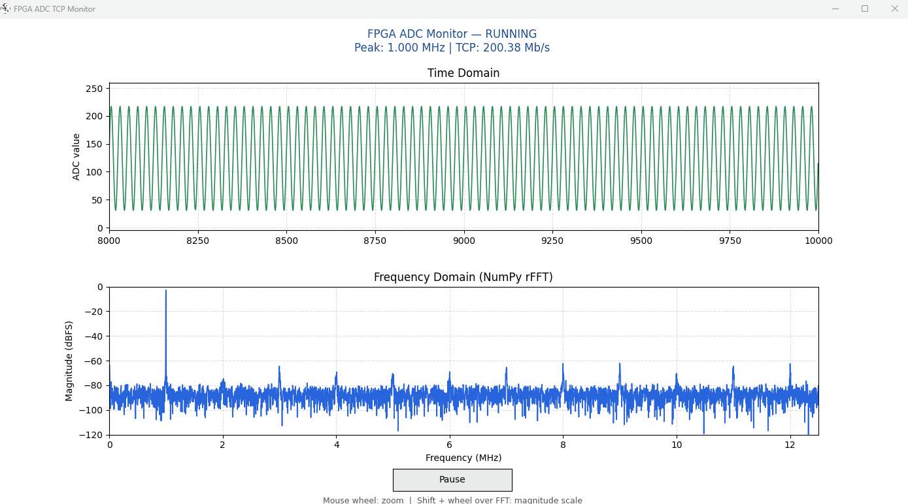

# Zynq-7020 FPGA TCP Server

[English](README.md) | **繁體中文**

以 Zynq-7020 **純 PL** 實作的 Gigabit Ethernet TCP Server。FPGA 透過 RGMII 連接 Ethernet PHY，不依賴 PS、Linux 或軟體協定棧，適合用於高速資料傳輸與網路協定實驗。

目前範例會在 TCP 連線建立後，持續傳送 `0x00`～`0xFF` 循環遞增的 unsigned 8-bit 測試資料。每個 TCP payload byte 代表一筆資料，不包含額外的封包標頭或時間戳記。

## 主要功能

- 1 GbE RGMII／GMII 資料路徑
- ARP Request／Reply
- ICMP Echo，可使用 `ping` 測試
- 單連線 TCP Server 與雙向資料介面
- IPv4、TCP checksum 與 Ethernet CRC/FCS
- TCP sliding window、逾時重傳與接收緩衝
- Clause 22 MDIO PHY 初始化與連線狀態讀取
- NumPy 即時頻譜分析工具

## 開發環境

| 項目 | 設定 |
| --- | --- |
| 開發板 | 正点原子（ALIENTEK）ATK-DF7020P |
| FPGA | AMD/Xilinx Zynq-7020 `XC7Z020CLG400-2` |
| Vivado | 2025.1 |
| Top module | `top` |
| 系統時脈 | 50 MHz |
| Ethernet | 1 GbE RGMII |

## 預設網路設定

| 項目 | 預設值 |
| --- | --- |
| FPGA MAC | `00:11:22:33:44:55` |
| FPGA IP | `192.168.1.10` |
| TCP Port | `5000` |
| 建議 PC IP | `192.168.1.102/24` |

FPGA 端設定可在 [`rtl/top.v`](rtl/top.v) 修改。

## 快速開始

1. 使用 Vivado 2025.1 開啟 [`prj/tcp_zynq7020.xpr`](prj/tcp_zynq7020.xpr)。
2. 依序執行 **Synthesis → Implementation → Generate Bitstream**。
3. 使用 Hardware Manager 將 bitstream 燒錄至開發板。
4. 將 PC 有線網卡設為固定 IP，例如 `192.168.1.102/24`。
5. 連接網路線後使用 `ping 192.168.1.10` 確認 FPGA 可回應。

## 在 FPGA 中使用 TCP

[`rtl/top.v`](rtl/top.v) 已經完成 PHY、RGMII 與 TCP 核心的連接。使用者邏輯只需要透過 [`eth_tcp_top`](rtl/eth_tcp_top.v) 的 application interface 收送資料：

```text
使用者邏輯／ADC  ⇄  app_tx / app_rx  ⇄  eth_tcp_top  ⇄  GMII  ⇄  RGMII  ⇄  Ethernet PHY
```

| 訊號 | 說明 |
| --- | --- |
| `tcp_app_clk` | application interface 時脈，目前為 125 MHz |
| `tcp_connected_o` | TCP 連線建立完成時為 1 |
| `app_tx_data[7:0]` | FPGA 傳送給 PC 的資料 |
| `app_tx_valid` | FPGA 表示目前的 TX data 有效 |
| `app_tx_ready` | TCP 核心可以接受 TX data |
| `app_tx_flush` | 將目前尚未填滿 MSS 的資料立即送出 |
| `app_rx_data[7:0]` | PC 傳送給 FPGA 的資料 |
| `app_rx_valid` | TCP 核心表示 RX data 有效 |
| `app_rx_ready` | 使用者邏輯可以接受 RX data |
| `app_rx_last` | 目前收到的 TCP payload 最後一個 byte |

### FPGA 傳送資料

只有在 `app_tx_valid && app_tx_ready` 為 1 的 clock，TCP 核心才會收下一個 byte。當 `ready` 為 0 時，必須保持 `data` 與 `valid` 不變。

以下是目前遞增測試資料的簡化寫法：

```verilog
reg [7:0] tx_data;

assign app_tx_valid = tcp_connected;
assign app_tx_flush = 1'b0;

always @(posedge tcp_app_clk or negedge sys_rst_n) begin
    if (!sys_rst_n || !tcp_connected)
        tx_data <= 8'd0;
    else if (app_tx_valid && app_tx_ready)
        tx_data <= tx_data + 8'd1;
end
```

連續串流時可讓 `app_tx_flush` 維持 0，核心會在累積至 MSS 後送出。若要立即送出不足一個 MSS 的短資料，請在最後一個 byte 被 `valid && ready` 接受的同一個 clock 將 `app_tx_flush` 拉高。

### FPGA 接收資料

```verilog
assign app_rx_ready = 1'b1;

always @(posedge tcp_app_clk) begin
    if (app_rx_valid && app_rx_ready) begin
        command <= app_rx_data;

        if (app_rx_last)
            packet_done <= 1'b1;
    end
end
```

若使用者邏輯暫時無法接收，可將 `app_rx_ready` 拉低，核心會保持目前的 `data`、`valid` 與 `last`。

目前的 `top` 會接收 PC 傳來的資料，並將 `0x01`、`0x00` 分別記錄為開始與停止狀態。不過目前 TX valid 仍直接跟隨 TCP 連線狀態，因此連線建立後會持續傳送測試資料；這兩個命令尚未實際暫停或恢復 TX 串流。

### 換成 ADC 或其他資料來源

1. 在 [`rtl/top.v`](rtl/top.v) 移除或取代 `test_counter`。
2. 將資料接到 `app_tx_data`，有資料時拉高 `app_tx_valid`。
3. 只在 `app_tx_valid && app_tx_ready` 時讀取下一筆資料。
4. 如果資料來源不是 `tcp_app_clk` 時脈域，先使用 asynchronous FIFO 做 clock domain crossing。
5. 使用 `tcp_connected_o` 在尚未連線時停止或清除資料流程。

## Python 工具

建議使用 Python 3.11（目前使用版本為 3.11.9）。標準函式庫不需要另外安裝，額外套件可使用以下指令安裝：

```powershell
python -m pip install numpy matplotlib pandas
```

| 程式 | 用途 |
| --- | --- |
| [`Realtime_ADC_Monitor.py`](python/Realtime_ADC_Monitor.py) | 即時顯示 8-bit 資料、TCP 速率、時域波形與 NumPy rFFT 頻譜；不會寫入檔案 |
| [`Catch_8bit.py`](python/Catch_8bit.py) | 接收指定長度的資料，可檢查遞增測試碼並輸出 BIN／CSV |
| [`CSV_show.py`](python/CSV_show.py) | 讀取既有 CSV，顯示時域波形並使用 NumPy rFFT 分析頻譜 |

執行即時監看：

```powershell
python python/Realtime_ADC_Monitor.py
```

接收固定長度的資料：

```powershell
python python/Catch_8bit.py
```

分析已儲存的 CSV：

```powershell
python python/CSV_show.py
```

`Realtime_ADC_Monitor.py` 預設以 125 MS/s 計算頻率軸；`CSV_show.py` 預設以 25 MS/s 計算，並標示預期的 500 kHz 訊號。若實際取樣率不同，請先修改對應程式中的取樣率設定。

## Demo



## ADC Streaming Demo

The following demonstrations show unsigned 8-bit ADC samples being streamed continuously from the FPGA to a PC through the hardware TCP engine.

The ADC operates at 25 MSPS, corresponding to a raw payload rate of approximately 200 Mbit/s. The Python monitor displays the received samples in the time domain and calculates a one-sided NumPy rFFT spectrum in real time. A Hann window is applied before the FFT to reduce spectral leakage.

### 1.1 MHz Input Signal

The monitor detects a stable peak near 2 MHz while continuously receiving ADC data at approximately 200 Mbit/s.



### 1.0 MHz Input Signal and Harmonics

This example uses an approximately 1.0 MHz input signal. The fundamental frequency is clearly visible together with harmonic and spurious components across the 0–12.5 MHz Nyquist band.

The displayed noise floor and harmonic components originate from the complete acquisition path, which may include the signal source, analog front end, ADC quantization, clock jitter, power noise, and digital coupling.



The frequency-domain display is intended as a real-time diagnostic tool. No digital low-pass filter is applied to the received samples; only DC removal and a Hann window are used before the FFT.

## 專案結構

```text
TCP_ZYNQ7020/
├─ prj/       Vivado 專案
├─ rtl/       ARP、ICMP、TCP、MDIO 與 RGMII RTL
├─ sim/       Top、TCP、MDIO 等 testbench
├─ python/    PC 端接收與即時分析工具
├─ xdc/       腳位與時脈約束
└─ README.md
```

## 備註

- 本專案目前是固定 IPv4、單一 TCP 連線的實驗設計。
- 目前 top module 傳送的是測試計數資料；接入實際 ADC 時，請替換 [`rtl/test_counter.v`](rtl/test_counter.v) 的資料來源。
- 不包含 DHCP、IPv6 或完整的 TCP congestion control。
- The pin constraints are based on the ALIENTEK ATK-DF7020P board documentation.ALIENTEK is a trademark of its respective owner.

## License
This project is licensed under the [MIT License](LICENSE).

